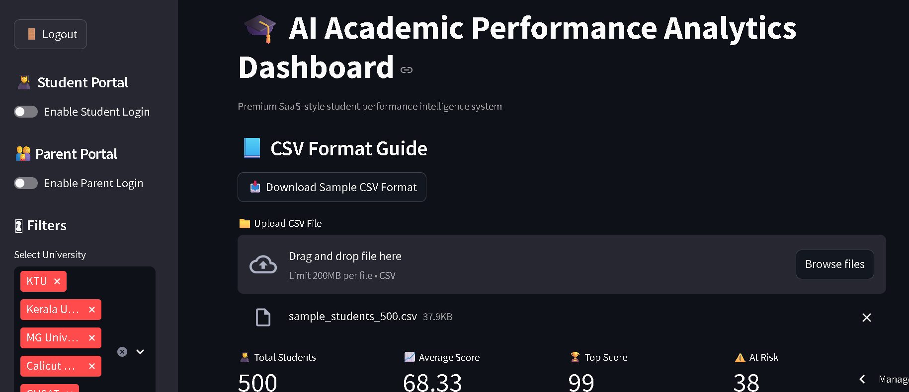
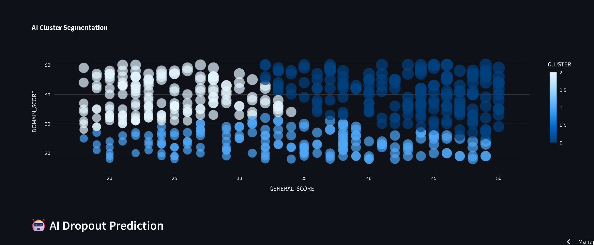

# 🎓 AI Academic Performance Analytics SaaS Platform

An enterprise-grade **AI-powered multi-tenant academic analytics SaaS
platform** built using **Streamlit + FastAPI + Machine Learning**.

Designed for **schools, colleges, coaching centers, universities,
placement institutes, and EdTech startups**, this platform converts raw
student data into **actionable academic intelligence, dropout risk
insights, placement readiness scores, forecasting, and executive
reporting**.

------------------------------------------------------------------------

## 🚀 Live Demo

### 🌐 Frontend Dashboard

👉 https://ai-academic-analytics-dashboard-5ujujechqk42wgnsfukjsn.streamlit.app/

### ⚡ Backend API Docs

👉 https://ai-academic-backend.onrender.com/docs
- 📊 Executive PDF sample report screenshots included in demo

------------------------------------------------------------------------

## ✨ Enterprise Features

### 🎛 Core Dashboard

-   📁 CSV upload with large dataset support
-   🎯 university + program filters
-   📊 real-time KPI dashboard
-   🏆 top performer spotlight
-   🔍 student drilldown search
-   📈 student vs university benchmarking
-   📚 grade distribution analysis
-   🏫 university-wise analytics
-   📘 program-wise benchmarking
-   📈 semester trend analysis

### 🤖 AI & Machine Learning

-   🎯 KMeans student clustering
-   🚨 AI dropout risk prediction
-   🎓 placement probability prediction
-   📈 next semester forecasting
-   🧠 GenAI academic advisor
-   🎯 intervention recommendation engine
-   🌲 real ML model training pipeline
-   📊 model evaluation dashboard

### 🔐 SaaS Platform Modules

-   🏢 multi-college tenant login
-   👨‍🎓 student self-service portal
-   👨‍👩‍👧 parent progress portal
-   🔐 role-based college access
-   📧 executive email reporting
-   📄 premium PDF reporting
-   ⚡ FastAPI backend microservices
-   🌐 live backend KPI APIs

------------------------------------------------------------------------

## 📸 Dashboard Preview

Store screenshots in `assets/`

``` markdown




```

------------------------------------------------------------------------

## 🛠️ Tech Stack

### Frontend

-   Streamlit
-   Pandas
-   Plotly

### Backend

-   FastAPI
-   Uvicorn
-   REST APIs

### Machine Learning

-   Scikit-learn
-   KMeans
-   Predictive Modeling
-   Forecasting

### Reporting

-   ReportLab
-   Email Automation

------------------------------------------------------------------------

## 📂 Project Structure

``` bash
ai-academic-analytics-dashboard/
│── app.py
│── requirements.txt
│── README.md
│
├── backend/
│   ├── main.py
│   └── routes.py
│
├── core/
│   ├── analytics.py
│   ├── clustering.py
│   ├── predictive_model.py
│   ├── forecasting.py
│   ├── placement_ai.py
│   ├── genai_advisor.py
│   ├── reporting.py
│   └── ...
│
├── data/
│   └── sample_students_500.csv
│
└── assets/
    ├── dashboard_main.png
    ├── ai_predictions.png
    ├── pdf_report.png
    └── api_docs.png
```

------------------------------------------------------------------------

## 💼 Business Use Cases

This dashboard can be used by:

-   🎓 Colleges & Universities
-   📚 Coaching Centers
-   🏫 Schools
-   🚀 EdTech Startups
-   💼 Placement & Training Institutes
-   📊 Academic Coordinators / HODs

### Practical Use Cases

-   student performance monitoring
-   topper & weak student analysis
-   semester performance tracking
-   batch/program benchmarking
-   risk segmentation
-   executive academic reporting
-   intervention planning dashboards

------------------------------------------------------------------------

## ⚡ Installation

``` bash
git clone https://github.com/xansar1/ai-academic-analytics-dashboard.git
cd ai-academic-analytics-dashboard
pip install -r requirements.txt
```

### ▶️ Run Backend

``` bash
uvicorn backend.main:app --reload --host 0.0.0.0 --port 8000
```

### ▶️ Run Frontend

``` bash
streamlit run app.py --server.port 8501
```

------------------------------------------------------------------------

## 📄 Sample Output

The executive PDF includes: - KPI summary - top performer - risk
overview - student dataset preview - grade insights - institutional
benchmarking

------------------------------------------------------------------------

## 🚀 Future Scope

-   🔐 Admin login & multi-college access
-   📈 Next semester score forecasting
-   🎯 Placement readiness prediction
-   🧠 AI intervention recommendations
-   ☁️ cloud database integration
-   👨‍🏫 faculty-level analytics
-   📄 downloadable PDF reports with advanced visual analytics

------------------------------------------------------------------------

## 👨‍💻 Developer

Built with ❤️ by **Ansar**
